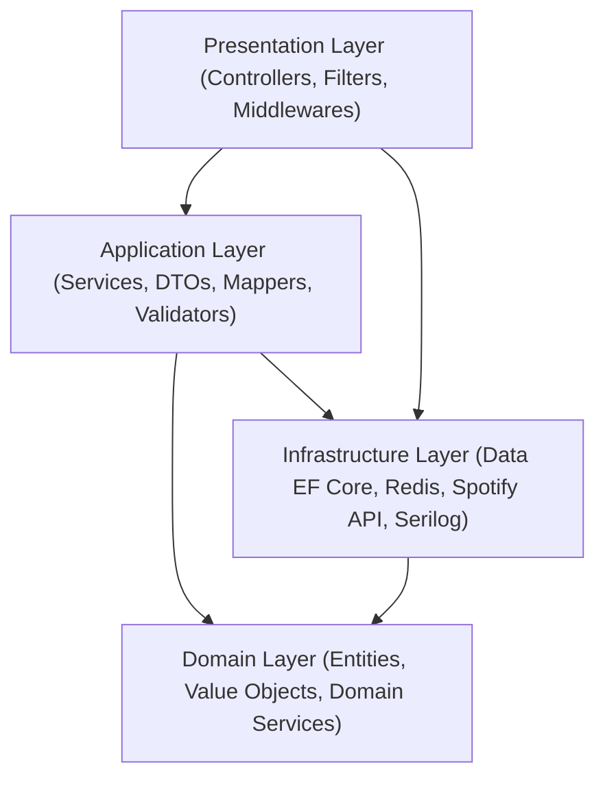
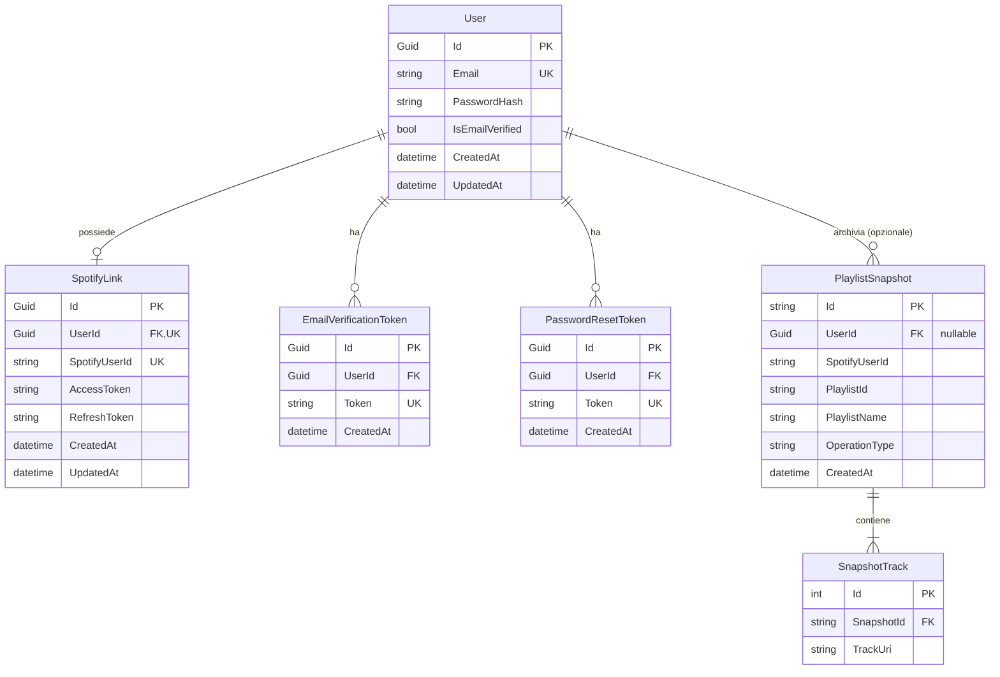

# Documento dei Requisiti di Sistema - TracksByPopularity

## 1. Introduzione e Obiettivi del Progetto

### 1.1 Scopo del Progetto
**TracksByPopularity** è una piattaforma di back-end sviluppata in **.NET 10 (ASP.NET Core Web API)** progettata per integrarsi con l'ecosistema **Spotify**. Il sistema permette agli utenti di analizzare la propria libreria di brani salvati, categorizzarli automaticamente in playlist dedicate in base all'indice di popolarità fornito da Spotify (valore intero normalizzato tra 0 e 100) e gestire playlist focalizzate sui propri artisti preferiti.

Oltre alla categorizzazione, il sistema offre funzionalità avanzate di:
- **Sicurezza e Backup**: Creazione automatica di snapshot di sicurezza prima di qualsiasi operazione distruttiva sulle playlist, con cronologia e capacità di ripristino istantaneo (*undo/restore*).
- **Doppia Modalità di Accesso**: Supporto per sessioni dirette tramite Spotify OAuth 2.0 e per un sistema di account utente nativo (Email/Password con hashing BCrypt e token JWT).
- **Architettura Resiliente e Prestante**: Livello di caching distribuito con Redis, compressione GZip e policy di retry Polly per minimizzare il consumo della quota di rate-limiting delle API Spotify.

---

## 2. Architettura di Sistema e Stack Tecnologico

Il progetto adotta i principi della **Clean Architecture / Onion Architecture** e del **Domain-Driven Design (DDD)**, garantendo una rigorosa separazione delle responsabilità e l'applicazione dei principi SOLID (in particolare Dependency Inversion e Interface Segregation).



### 2.1 Stack Tecnologico
- **Runtime & Framework**: .NET 10.0 (C# 13, con primary constructors, collection expressions e nullable reference types).
- **Web API**: ASP.NET Core Web API con Controllers standard, FluentValidation e Response Caching.
- **Data Persistence**: MariaDB / MySQL gestito tramite **Entity Framework Core 9** (`Pomelo.EntityFrameworkCore.MySql`) con migrazioni automatiche all'avvio.
- **Distributed Caching**: **Redis** (`StackExchange.Redis`), arricchito con compressione GZip e policy di resilienza Polly (`Microsoft.Extensions.Resilience`).
- **Integrazione Terze Parti**:
  - `SpotifyAPI.Web` (v7.1.1): Client ufficiale per le API REST e il flusso OAuth di Spotify.
  - `BCrypt.Net-Next`: Hashing e verifica crittografica delle credenziali utente.
  - Mailtrap: Invio di email transazionali (verifica account e recupero password).
- **Logging & Tracing**: **Serilog** con sink Console strutturato e sink File JSON compatto con rotazione giornaliera (retention 30 giorni).
- **Containerizzazione & Hosting**: Dockerfile multistage e configurazione per deployment su **Fly.io** (`fly.toml`).

---

## 3. Requisiti Funzionali (Functional Requirements)

### RF-01: Gestione Account Locale e Autenticazione JWT
- **RF-01.1 Registrazione Utente**: L'utente può registrarsi fornendo email valida e password. La password viene cifrata tramite BCrypt prima del salvataggio nel database.
- **RF-01.2 Verifica Email**: Alla registrazione viene generato un token univoco inviato via email tramite Mailtrap. L'account è abilitato al login solo previa verifica positiva.
- **RF-01.3 Login con JWT**: L'utente registrato può autenticarsi ricevendo un token JWT (validità 7 giorni). Il token viene trasmesso sia nel corpo della risposta sia memorizzato in un cookie sicuro `HttpOnly` (`access_token`, `SameSite=Strict`).
- **RF-01.4 Recupero e Reset Password**: Flusso di recupero password con generazione di token monouso, notifica email e validazione della nuova credenziale.
- **RF-01.5 Cambio Password Autenticato**: Gli utenti autenticati possono modificare la propria password fornendo la password attuale e quella nuova.
- **RF-01.6 Informazioni Profilo (`/me`)**: Accesso alle informazioni dell'account autenticato (id, email, stato verifica email, stato collegamento Spotify).
- **RF-01.7 Logout Locale**: Invalidazione e rimozione del cookie di sessione JWT.

### RF-02: Integrazione Spotify OAuth 2.0
- **RF-02.1 Flusso Authorization Code**: Generazione dell'URL di autorizzazione verso Spotify con gli scope necessari:
  - `user-read-email`, `user-read-private`, `user-library-read`, `user-library-modify`, `user-top-read`, `playlist-modify-private`, `playlist-modify-public`, `user-follow-read`.
- **RF-02.2 Scambio Codice e Salvataggio Token**: Ricezione del codice di autorizzazione nella callback, scambio con Access Token e Refresh Token, e archiviazione crittografata su Redis associata allo `SpotifyUserId`.
- **RF-02.3 Tracciamento Sessione Spotify**: Gestione del contesto utente tramite cookie `spotify_user_id` e supporto all'header HTTP `X-Spotify-User-Id` (prioritario rispetto al cookie) per scenari client-side/cross-origin.
- **RF-02.4 Verifica Stato Autenticazione (`/auth/is-auth`)**: Validazione in tempo reale della sessione verificando la disponibilità e validità del token memorizzato in Redis.
- **RF-02.5 Logout Spotify**: Rimozione dei token da Redis e cancellazione del cookie associato.

### RF-03: Collegamento Account Spotify con Account Locale
- **RF-03.1 Link Spotify Account**: Un utente autenticato con account nativo può associare il proprio account Spotify completando il flusso OAuth e registrando il mapping nella tabella `SpotifyLinks`.
- **RF-03.2 Status Collegamento**: Possibilità di verificare se l'account locale corrente è collegato a Spotify e con quale identificativo.
- **RF-03.3 Unlink Spotify Account**: Scollegamento sicuro dell'account Spotify, con cancellazione del record su database e rimozione delle credenziali in cache.

### RF-04: Organizzazione Brani per Indice di Popolarità
- **RF-04.1 Fasce di Popolarità Supportate**:
  - `less`: popolarità da **0 a 20**
  - `less-medium`: popolarità da **21 a 40**
  - `medium`: popolarità da **41 a 60**
  - `more-medium`: popolarità da **61 a 80**
  - `more`: popolarità da **81 a 100**
- **RF-04.2 Nomenclatura Playlist**: Creazione o riuso della playlist di destinazione secondo la convenzione `Popularity: {Min}-{Max}` (es. `Popularity: 41-60`).
- **RF-04.3 Procedura di Aggiornamento Sicuro**:
  1. Ricerca o creazione della playlist di riferimento.
  2. Creazione preventiva dello **snapshot** di backup della playlist esistente.
  3. Svuotamento integrale delle tracce correnti dalla playlist.
  4. Filtraggio delle tracce salvate della libreria utente appartenenti al range specificato.
  5. Inserimento a blocchi (*batching* fino a 100 tracce per richiesta, secondo i vincoli di Spotify).

### RF-05: Organizzazione Brani per Artista
- **RF-05.1 Elenco Artisti della Libreria (`/api/track/artists`)**: Estrazione degli artisti unici presenti nei brani salvati che l'utente segue attivamente, con aggregazione e ordinamento decrescente per numero di tracce possedute.
- **RF-05.2 Ripartizione per Artista su 3 Playlist**:
  - Fascia `less`: popolarità da **0 a 33** &rarr; playlist `{ArtistName} less`
  - Fascia `medium`: popolarità da **34 a 66** &rarr; playlist `{ArtistName} medium`
  - Fascia `more`: popolarità da **67 a 100** &rarr; playlist `{ArtistName} more`
- **RF-05.3 Workflow Atomico per Artista**: Backup preventivo di ciascuna delle tre playlist, svuotamento controllato e ripopolamento selettivo con i brani dell'artista corrispondenti a ciascuna fascia.

### RF-06: Backup e Ripristino Playlist (Snapshot System)
- **RF-06.1 Snapshot Automatico**: Cattura dello stato corrente di una playlist (metadati e lista ordinata di URI delle tracce) prima di ogni operazione di categorizzazione.
- **RF-06.2 Consultazione Snapshot (`/api/backup/list`)**: Recupero della lista storica degli snapshot generati per l'utente corrente, corredati di timestamp, nome playlist, tipo operazione e conteggio tracce.
- **RF-06.3 Ripristino Playlist (`/api/backup/restore/{snapshotId}`)**: Ripristino atomico dello stato salvato nello snapshot sulla playlist originale, con contestuale invalidazione della cache delle playlist.
- **RF-06.4 Cancellazione Manuale Snapshot (`/api/backup/{snapshotId}`)**: Eliminazione manuale di uno specifico snapshot dal database.

### RF-07: Gestione Cache e Playlist Utente
- **RF-07.1 Elenco Playlist (`/api/playlist/all`)**: Restituzione delle playlist possedute dall'utente con caching a 15 minuti su Redis.
- **RF-07.2 Refresh Forzato (`/api/playlist/refresh`)**: Invalidazione esplicita della cache Redis delle playlist e nuovo recupero aggiornato da Spotify.

### RF-08: Health Check & Monitoraggio
- **RF-08.1 Endpoint di Liveness (`/health`)**: Endpoint pubblico che risponde con codice HTTP 200 e payload `{ status: "healthy", timestamp: ... }` per health probe di Docker e Fly.io.

---

## 4. Requisiti Non Funzionali (Non-Functional Requirements)

### RNF-01: Performance e Caching
- **RNF-01.1 Cache Redis Multi-livello**:
  - Tracce della libreria utente (`tracks:{spotifyUserId}`)
  - Elenco playlist (`playlists:{spotifyUserId}`)
  - Artisti seguiti (`artists:{spotifyUserId}`)
  - Token OAuth (`spotify_token:{spotifyUserId}`)
- **RNF-01.2 Compressione Dati**: Tutti i payload salvati su Redis superiori a soglie critiche sono compressi tramite **GZip** per ridurre la memoria occupata e la latenza di rete.
- **RNF-01.3 Resilienza Redis (Polly)**: Le operazioni di lettura/scrittura su Redis implementano politiche di retry con backoff lineare/esponenziale per gestire disconnessioni transitorie senza generare errori 500 al client.
- **RNF-01.4 HTTP Response Caching**: Risposte corredate di intestazioni `Cache-Control` ed `ETag` (es. lista artisti e playlist) per ottimizzare il caching lato client/proxy.

### RNF-02: Sicurezza e Protezione dei Dati
- **RNF-02.1 Crittografia Password**: Password hashate con algoritmo **BCrypt** con salt generato automaticamente.
- **RNF-02.2 Firma e Validità Token JWT**: Token firmati con chiave simmetrica (minimo 32 caratteri, HMAC-SHA256) con scadenza rigida e `ClockSkew` azzerato.
- **RNF-02.3 Cookie Sicuri**: I cookie di autenticazione (`access_token`, `spotify_user_id`) devono avere i flag `HttpOnly`, `SameSite=Strict` o `Lax` e `Secure=true` in produzione.
- **RNF-02.4 Isolamento Dati**: Ogni utente può accedere esclusivamente ai propri snapshot, playlist e token. Nessuna operazione può manipolare o leggere dati di altri account.
- **RNF-02.5 Validazione Input**: Richieste validate a monte tramite `FluentValidation` prima dell'esecuzione dei controller.

### RNF-03: Affidabilità e Integrità
- **RNF-03.1 Pattern Snapshot-Before-Mutation**: Nessuna playlist può essere svuotata o sovrascritta senza che sia stato preventivamente persistito uno snapshot coerente.
- **RNF-03.2 Gestione Globale delle Eccezioni**: Tutte le eccezioni non gestite vengono intercettate dal middleware `ExceptionHandlingMiddleware`, registrate nei log con stack trace e convertite in una risposta uniforme `ApiResponse.Fail(...)`.
- **RNF-03.3 Migrazioni Automatiche**: Il database applica automaticamente all'avvio tutte le migrazioni EF Core pendenti.

### RNF-04: Manutenibilità e Pulizia Automatica
- **RNF-04.1 Retention Snapshot (30 giorni)**: Il servizio in background `SnapshotCleanupService` si attiva ogni 24 ore ed elimina automaticamente gli snapshot più vecchi di 30 giorni e le tracce correlate (eliminazione a cascata).
- **RNF-04.2 Controllo Chiavi Orfane**: `RedisCacheResetService` controlla ciclicamente le chiavi per monitorare gli accessi e prevenire proliferazione di chiavi orfane.

### RNF-05: Logging e Observability
- **RNF-05.1 Logging Strutturato**: Tutti gli eventi applicativi e gli errori sono tracciati con **Serilog** arricchiti di: `MachineName`, `ThreadId`, `EnvironmentName` e contesto di esecuzione.
- **RNF-05.2 Rotazione Log**: File di log compatti in formato JSON (`logs/tracks-by-popularity-.log`) archiviati su base giornaliera con conservazione massima di 30 giorni.

---

## 5. Modello Dati e Schema Database (MariaDB/MySQL)



### 5.1 Dettaglio Tabelle e Vincoli
- **`Users`**: Tabella degli account nativi. Email univoca, indice su `Email`.
- **`SpotifyLinks`**: Relazione 1-a-1 con `Users`. Contiene token Spotify e `SpotifyUserId` univoco. Eliminazione a cascata con l'utente.
- **`EmailVerificationTokens` & `PasswordResetTokens`**: Token monouso con scadenza implicita/esplicita e vincolo di unicità sul token. Eliminazione a cascata con l'utente.
- **`PlaylistSnapshots`**: Snapshot della playlist. `UserId` è opzionale (`OnDelete: SetNull`) per permettere l'utilizzo anche a sessioni solo Spotify senza account nativo. Indici su `UserId`, `SpotifyUserId` e `CreatedAt`.
- **`SnapshotTracks`**: Lista ordinata delle tracce (URI Spotify es. `spotify:track:...`) che compongono lo snapshot. Relazione molti-a-uno con `PlaylistSnapshots` (`OnDelete: Cascade`).

---

## 6. Specifiche e Contratti delle API

Tutte le risposte seguono il contratto standard uniforme `ApiResponse`:
```json
{
  "success": true,
  "data": { ... },
  "message": "Operazione completata con successo",
  "error": null
}
```

### 6.1 Mappa Completa degli Endpoint

| Modulo | Metodo | Endpoint | Auth Richiesta | Descrizione |
|---|---|---|---|---|
| **Health** | `GET` | `/health` | Nessuna | Verifica stato di funzionamento servizio |
| **Auth Spotify** | `GET` | `/auth/login` | Nessuna | Restituisce l'URL di redirect Spotify |
| **Auth Spotify** | `GET` | `/auth/callback` | Nessuna | Callback OAuth: scambio token e salvataggio |
| **Auth Spotify** | `GET` | `/auth/is-auth` | Cookie o Header | Verifica sessione Spotify attiva |
| **Auth Spotify** | `POST` | `/auth/logout` | Cookie o Header | Logout Spotify e rimozione token da Redis |
| **Account** | `POST` | `/api/account/register` | Nessuna | Registrazione nuovo utente |
| **Account** | `POST` | `/api/account/login` | Nessuna | Login utente (restituisce JWT e cookie) |
| **Account** | `GET` | `/api/account/verify/{token}`| Nessuna | Verifica email utente |
| **Account** | `POST` | `/api/account/forgot-password`| Nessuna | Richiesta link reset password |
| **Account** | `POST` | `/api/account/reset-password` | Nessuna | Impostazione nuova password tramite token |
| **Account** | `POST` | `/api/account/change-password`| JWT Bearer | Modifica password da autenticato |
| **Account** | `POST` | `/api/account/link-spotify` | JWT Bearer | Associazione manuale credenziali Spotify |
| **Account** | `GET` | `/api/account/me` | JWT Bearer | Informazioni profilo utente corrente |
| **Account** | `POST` | `/api/account/logout` | JWT Bearer | Invalida il cookie `access_token` |
| **Spotify Link**| `GET` | `/api/spotify/link-url` | JWT Bearer | Genera URL per il link Spotify |
| **Spotify Link**| `GET` | `/api/spotify/callback` | Nessuna | Callback OAuth di associazione account |
| **Spotify Link**| `GET` | `/api/spotify/status` | JWT Bearer | Verifica se l'account corrente è associato |
| **Spotify Link**| `POST` | `/api/spotify/unlink` | JWT Bearer | Scollega l'account Spotify associato |
| **Tracce** | `POST` | `/api/track/popularity/{range}` | Spotify Auth | Popola playlist per range di popolarità |
| **Tracce** | `GET` | `/api/track/artists` | Spotify Auth | Lista artisti seguiti con brani salvati |
| **Tracce** | `POST` | `/api/track/artist` | Spotify Auth | Organizza i brani di un artista in 3 playlist |
| **Playlist** | `GET` | `/api/playlist/all` | Spotify Auth | Recupera tutte le playlist possedute |
| **Playlist** | `POST` | `/api/playlist/refresh` | Spotify Auth | Invalida la cache e ricarica le playlist |
| **Backup** | `GET` | `/api/backup/list` | Spotify Auth | Lista cronologica degli snapshot |
| **Backup** | `POST` | `/api/backup/restore/{id}` | Spotify Auth | Ripristina una playlist dallo snapshot |
| **Backup** | `DELETE`| `/api/backup/{id}` | Spotify Auth | Elimina uno snapshot esistente |

---

## 7. Servizi in Background (Hosted Background Services)

1. **`SnapshotCleanupService`**:
   - **Intervallo di esecuzione**: Ogni 24 ore.
   - **Compito**: Recupera e rimuove fisicamente dal database tutti i record di `PlaylistSnapshots` (e relativi `SnapshotTracks` via CASCADE) aventi data di creazione anteriore a 30 giorni.
2. **`RedisCacheResetService`**:
   - **Intervallo di esecuzione**: Ogni 5 minuti.
   - **Compito**: Scansiona la disponibilità degli endpoint Redis, controlla il TTL delle chiavi di cache (`tracks:*`, `playlists:*`, `artists:*`, `spotify_token:*`) e monitora il numero di sessioni utente attive.
3. **`PrefetchService`**:
   - **Intervallo di esecuzione**: Ogni 5 minuti.
   - **Compito**: Monitora lo stato di salute generale del livello di cache e abilita la predisposizione/warming di query frequenti.

---

## 8. Requisiti di Configurazione ed Environment

Il sistema richiede la valorizzazione delle seguenti variabili d'ambiente (definite in `.env`, `appsettings.json` o secret manager):

| Variabile | Scopo | Esempio / Default |
|---|---|---|
| `JWT_SECRET` | Chiave di firma token JWT (min. 32 caratteri) | `min-32-character-secret-key-for-jwt` |
| `DATABASE_CONNECTION_STRING` | Stringa di connessione MariaDB/MySQL | `Server=localhost;Port=3306;Database=tracksbypopularity;User=root;Password=***;` |
| `SPOTIFY_CLIENT_ID` | Client ID registrato su Spotify Developer Dashboard | `32-char-guid` |
| `SPOTIFY_CLIENT_SECRET` | Client Secret dell'app Spotify | `32-char-secret` |
| `SPOTIFY_REDIRECT_URI` | Base URI di callback per l'autenticazione Spotify | `http://localhost:5242/auth/callback` |
| `REDIS_HOST` | Hostname del server Redis | `localhost` |
| `REDIS_PORT` | Porta del server Redis | `6379` |
| `REDIS_PASSWORD` | Password di accesso Redis (se abilitata) | `redis-secure-pwd` |
| `FRONTEND_ORIGIN` | URL della SPA/Frontend autorizzato in CORS | `http://localhost:5173` |
| `MAILTRAP_API_KEY` | Chiave API di Mailtrap per invio email transazionali | `mailtrap-secret-token` |
